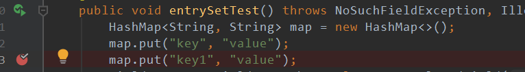
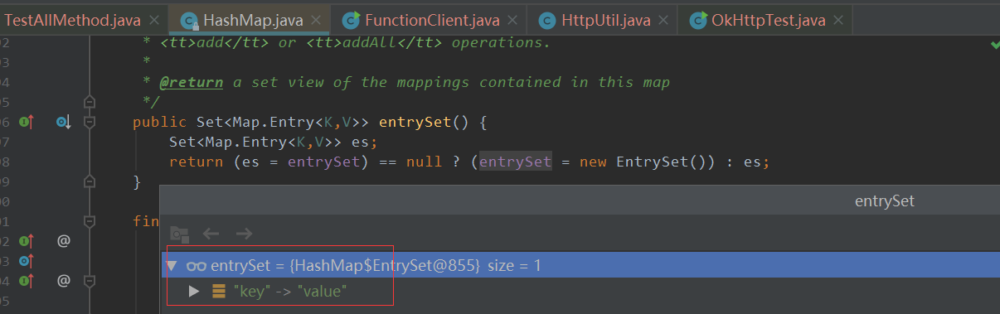
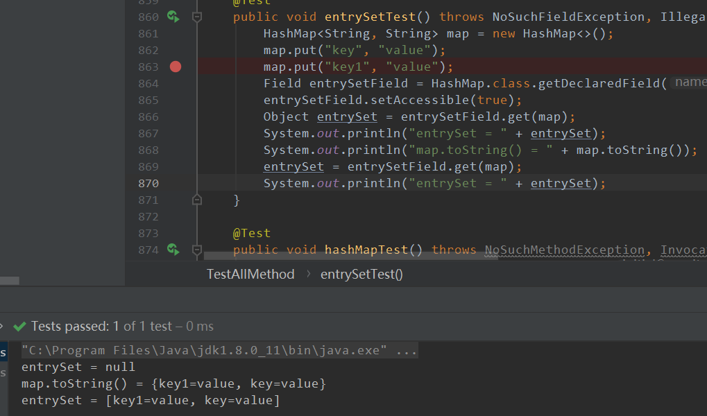

# HashMap的EntrySet探索

## 一：引言

**问题背景：我们没有在HashMap中找到EntrySet的赋值以及初始化，但是我们使用的时候他已经具备了表中的所有值**

> 我们在第二次put中debug，然后进入之后可以看到下图`entrySet`已经有值，但是在put一系列操作后没有对entrySet进行过赋值等，那么他是怎么会如此呢

> 这里我们只回答两个问题
>
> 1.EntrySet何时初始化
>
> 2.什么时候将值添加到entrySet中

## 二：回答问题

### 问题1

> 这个实际上是我们的调试器欺骗了我们，因为他调用了`toString()`方法，这里我们可以使用反射来看看使用和不使用这个方法后的区别
>
> **不使用**
>
> ~~~java
> HashMap<String, String> map = new HashMap<>();
> map.put("key", "value");
> map.put("key1", "value");
> Field entrySetField = HashMap.class.getDeclaredField("entrySet");
> entrySetField.setAccessible(true);
> Object entrySet = entrySetField.get(map);
> //这里打印结果就是null，我们使用反射手动的去获取entrySet属性
> System.out.println("entrySet = " + entrySet);
> ~~~
>
> **使用**
>
> ~~~java
> //显式toString方法，当然这个方法在HashMap中并没有去实现，他继承了AbstractMap，是他实现了toString方法
> map.toString();
> entrySet = entrySetField.get(map);
> System.out.println("entrySet = " + entrySet);
> ~~~
>
> **结果**
>
> 
>
> 那么我们就去看下神秘的`AbstractMap中的toString()方法`
>
> ~~~java
> //下面的代码我们可以不用看，重点在于第一句话，这里手动调用了entrySet方法，调用这个方法之后就会去第一次初始化
> public String toString() {
>     Iterator<Entry<K,V>> i = entrySet().iterator();
>     if (! i.hasNext())
>         return "{}";
>     //...
> }
> //这里是实现的entrySet方法
> public Set<Map.Entry<K,V>> entrySet() {
>     Set<Map.Entry<K,V>> es;
>     //初始化
>     return (es = entrySet) == null ? (entrySet = new EntrySet()) : es;
> }
> ~~~
>
> **所以第一个问题有了答案：在使用`toString`方法之后才会进行第一次初始化，这也是为什么我们使用反射来获取时候是null，因为反射没有走正常的创建路线，而是使用字节码接口获取**

### 问题2

> 实际上这个问题我们在看第一个问题解答时候就可以懂得答案
>
> 这里我们要懂得一件事情，那就是entrySet是内部类:
>
> ~~~java
> //我们可以看到这是一个很简单的内部类，相当于是一个key-value节点
> static class Node<K,V> implements Map.Entry<K,V> {
>         final int hash;
>         final K key;
>         V value;
>         Node<K,V> next;
> 
>         Node(int hash, K key, V value, Node<K,V> next) {
>             this.hash = hash;
>             this.key = key;
>             this.value = value;
>             this.next = next;
>         }
>     //..一些获取和设置操作
> }
> ~~~
>
> 每次获取的时候都是获取到这样一个对象返给我们
>
> ~~~java
> public Set<Map.Entry<K,V>> entrySet() {
>     Set<Map.Entry<K,V>> es;
>     return (es = entrySet) == null ? (entrySet = new EntrySet()) : es;
> }
> ~~~
>
> 

