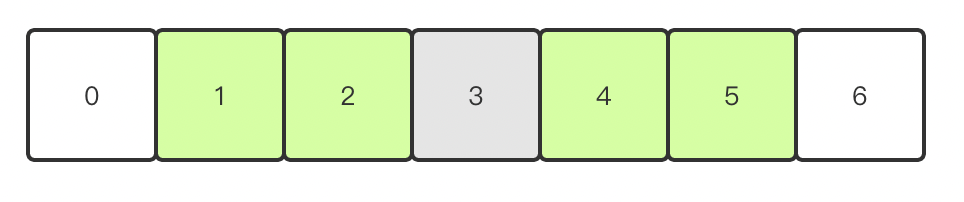

# `ThreadLocalMap`的扩容机制

> `ThreadLocalMap`是`ThreadLocal`的一个静态内部类，他作用就是用来在`ThreadLocal`存储用户放置的value，当然实际上我们只可以看到一个，相同的会被覆盖(关于他的set过程这里暂时不说，这里我们要说的是他的扩容机制，当存储的数据量超过阈值时候就需要`rehash`，如果存储的内容大小超过(阈值 - 阈值/4)时候要`resize`)

稍微贴一下他的源码

- [x] ~~~java
  static class ThreadLocalMap {
  
  	//注意这里Entry继承了弱引用
    //使用ThreadLocal作为key，使用开发者存储的值作为value构建的Entry
    static class Entry extends WeakReference<ThreadLocal<?>> {
      //这个值跟ThreadLocal相关联
      Object value;
  
      Entry(ThreadLocal<?> k, Object v) {
        super(k);
        value = v;
      }
    }
  	//初识容量
    private static final int INITIAL_CAPACITY = 16;
    //存储内容的容器，这里我们可以看到这个map不是类似于HashMap的结构，所以说他在存储内容时候不会存在拉链式，也就有后面的消除过期kay值以及扩容机制
    private Entry[] table;
    //存储的entry数量
    private int size = 0;
  	//阈值，决定着是否要进行扩容
     private int threshold; // Default to 0
  
      private void setThreshold(int len) {
      threshold = len * 2 / 3;
    }
  
    /**
           * Increment i modulo len.
           */
    private static int nextIndex(int i, int len) {
      return ((i + 1 < len) ? i + 1 : 0);
    }
    /**
           * Decrement i modulo len.
           */
    private static int prevIndex(int i, int len) {
      return ((i - 1 >= 0) ? i - 1 : len - 1);
    }
  
    /**
  	他的构造器，这里属于懒加载的方式，也就是只有第一次存放时候才回去初始化这个table
           */
    ThreadLocalMap(ThreadLocal<?> firstKey, Object firstValue) {
      table = new Entry[INITIAL_CAPACITY];
      int i = firstKey.threadLocalHashCode & (INITIAL_CAPACITY - 1);
      table[i] = new Entry(firstKey, firstValue);
      size = 1;
      setThreshold(INITIAL_CAPACITY);
    }
  
  
    /**
           * Set the value associated with key.
           *
           * @param key the thread local object
           * @param value the value to be set
           */
    private void set(ThreadLocal<?> key, Object value) {
  		//...
      if (!cleanSomeSlots(i, sz) && sz >= threshold)
        //这里就是如果执行完启发式清理工作后，未清理到任何数据，且当前散列数组中Entry的数量已经达到了列表的扩容阈值(len*2/3)，就回去执行这个方法
        rehash();
    }
    private void rehash() {
      //探测式清理过期key
      expungeStaleEntries();
  
      // 使用较低的双倍阈值以避免迟滞
      if (size >= threshold - threshold / 4)
        resize();
    }
  	
  }
  ~~~

**所以这里我们就会从`rehash`这个方法去探索一下这个神奇map的扩容机制**

## 一：入手

> 我们看到上面源码中可以看到，在执行`resize`之前还是要先进行探测式清理过期的key，再去判断这时候`size`与阈值的关系
>
> 那么我们在讲`resize`方法之前还是要先说明一下这个探测式清理的流程的

### 探测式清理

> 这种方式清理实际上就是`expungeStaleEntry`，我把这部分代码拉过来
>
> ~~~java
> //删除所有过期的entry
> private void expungeStaleEntries() {
> Entry[] tab = table;
> int len = tab.length;
> //从开始位置遍历数组逐个探测，然后找到tab[j].get() == null时候(当然这里e肯定是不可以为null的)将这个Entry置为null，然后会将沿途中没有过期的进行重新hash定位，计算出位置之后如果这个位置没有数据则直接放置，如果定位的位置有了数据则将未过期的数据放置在最靠近这个位置的entry == null的位置，使rehash后的Entry数据距离正确的桶的位置更近一些。
> for (int j = 0; j < len; j++) {
> Entry e = tab[j];
> 
> if (e != null && e.get() == null)
> expungeStaleEntry(j);
> }
> }
> //根据给定的位置删除过期的entry
> private int expungeStaleEntry(int staleSlot) {
> Entry[] tab = table;
> int len = tab.length;
> 
> // expunge entry at staleSlot
> tab[staleSlot].value = null;
> tab[staleSlot] = null;
> size--;
> 
> // 重新计算位置，直到我们碰到null的时候
> Entry e;
> int i;
> //这里nextIndex方法作用类似于+1，但是不同的地方在于它做了判断，保证+1之后不会大于len，若大于则返回0，相当于对len进行了%操作
> for (i = nextIndex(staleSlot, len);
>  (e = tab[i]) != null;
>  i = nextIndex(i, len)) {
> ThreadLocal<?> k = e.get();
> //说明这里的e是一个过期的，那么就将其中的内容置为null，然后将tab这个位置指向null并让表数量size减一
> if (k == null) {
> e.value = null;
> tab[i] = null;
> size--;
> } else {
> //此时说明这个位置是有值的，而且它没有过期
> int h = k.threadLocalHashCode & (len - 1);
> //此判断是保证不是相同位置的相同元素操作，也就是说计算出来的位置不是当前要处理的元素 
> if (h != i) {
>   tab[i] = null;
> 
> //往后遍历直到计算出来的位置对应的元素是null，然后让此时这个位置内容赋值为e
>   while (tab[h] != null)
>     h = nextIndex(h, len);
>   tab[h] = e;
> }
> }
> }
> return i;
> }
> ~~~
>
> **这里我们假设`staleSlot == 3`**，也就是要清除这个位置的数据（白色背景是没有数据，绿色背景是正常数据，灰色背景是过期数据，也就是要删除的）
>
> 
>
> 第一次进入这个方法时候便会执行如下代码
>
> ~~~java
> ThreadLocal<?> k = e.get();
> 
> if (k == null) {
>   //将引用置为null，同时让size--，这样的话相当于清除这个槽位的数据
>     e.value = null;
>     tab[i] = null;
>     size--;
> } 
> ~~~
>
> 如果这个数据没有过期，那么会计算它的位置，如果跟此时的`i`不相等说明此时发生了`hash`冲突，那么会使用`h`也就是后来计算出来的值作为新的位置往后迭代，找到最近的一个为`null`的位置
>
> ~~~java
> int h = k.threadLocalHashCode & (len - 1);
> if (h != i) {
>     tab[i] = null;
> 
>     while (tab[h] != null)
>         h = nextIndex(h, len);
> 
>     tab[h] = e;
> }
> ~~~
>
> 这里是处理正常的产生`Hash`冲突的数据，经过迭代后，有过`Hash`冲突数据的`Entry`位置会更靠近正确位置，这样的话，查询的时候 效率才会更高。

### 扩容机制

>  说过探测式清理那么就可以说一下这个扩容机制了，也就是说我们需要再次去看一下`rehash`方法，这个方法中首先会执行上述说明的探测式清理，然后再去判断`size >= threshold - threshold / 4`这个关系，如果此时已经大于，那么就会执行`resize`方法，也就是说它的`ThreadLocalMap`扩容机制有两步
>
> - 清理过期的key，然后将后面的数据位置进行重新ha sh定位确认
> - 如果此时`size >= threshold - threshold / 4`这个关系满足，则进行扩容，也就是`resize`
>
> 探测式清理已经说完，那么现在就需要说明一下这个`resize`方法(这个方法执行之后表容器大小会是原来的2倍)
>
> ~~~java
> private void resize() {
>   Entry[] oldTab = table;
>   int oldLen = oldTab.length;
>   //长度是原来的2倍
>   int newLen = oldLen * 2;
>   Entry[] newTab = new Entry[newLen];
>   int count = 0;
> 	//将原本表中的数据存放到新表中，遍历过程中，如果遍历中k已经过期则会直接清除(这里只需要让entry的value置为null即可)，没有过期的话则重新计算位置，当然会去判断这个位置在新表中是否有数据，如果有的话要去计算nextIndex(这个方法也很简单，就是为了它自增但又要保证它不会超过表长度，超过为置为0)，然后使用计算出来的准确位置在新表中进行重新赋值
>   for (Entry e : oldTab) {
>     if (e != null) {
>       ThreadLocal<?> k = e.get();
>       if (k == null) {
>         e.value = null; // help the GC
>       } else {
>         int h = k.threadLocalHashCode & (newLen - 1);
>         while (newTab[h] != null)
>           h = nextIndex(h, newLen);
>         newTab[h] = e;
>         count++;
>       }
>     }
>   }
> 	//设置新的阈值
>   setThreshold(newLen);
>   size = count;
>   table = newTab;
> }
> private void setThreshold(int len) {
>   threshold = len * 2 / 3;
> }
> private static int nextIndex(int i, int len) {
>   return ((i + 1 < len) ? i + 1 : 0);
> }
> ~~~
>
> 

**`ThreadLocalMap`的扩容机制也就这些，总结一下**

- 探测式清理
- 判断`map`中的元素数量与阈值的关系来判断是否要执行`resize`方法
- 执行`resize`方法实际上就是一个老数组数据转移到新数组中的过程，不过添加了过期`key`检查，以及位置计算(存放数据的位置是通过`hash`算法计算出来的，不是挨个赋值)

## 二：补充知识

> - **过期key**
>
> 想要解释这个问题我们必须懂得`java`的引用类型
>
> > - **强引用**：我们常常new出来的对象就是强引用类型，只要强引用存在，垃圾回收器将永远不会回收被引用的对象，哪怕内存不足的时候
> > - **软引用**：使用SoftReference修饰的对象被称为软引用，软引用指向的对象在内存要溢出的时候被回收
> > - **弱引用**：使用WeakReference修饰的对象被称为弱引用，只要发生垃圾回收，若这个对象只被弱引用指向，那么就会被回收
> > - **虚引用**：虚引用是最弱的引用，在 Java 中使用 PhantomReference 进行定义。虚引用中唯一的作用就是用队列接收对象即将死亡的通知
>
> ~~~java
> //这里对于ThreadLocal对象使用软引用
> /**
> 为什么这里使用软引用，而不是强引用呢？
> 假如是强引用，那么对于ThreadLocal对象是有两个地方引用，一是我们自己创建的强引用(TL_INT)，二是ThreadLocalMap中Entry中的key引用(这个引用我们可以看作为Reference中的T referent;)，如果我们自己创建的强引用被回收了，而ThreadLocalMap中Entry中的key对这个对象依旧存在强引用，如果不去手动删除这个key，那么这个ThreadLocal对象就不会被回收(除非当前线程消亡)
> 而这里使用弱引用呢，TL_INT被回收后，只剩下弱引用了，在下次GC时候，这个ThreadLocal对象就会被回收，但是有个问题在于，TheadLocal对象是作为Map的软引用存在的，他一旦被回收，value并没有回收，同时value也访问不到，这就造成了内存泄漏。ThreadLocalMap类的设计本身已经有了这一问题的解决方案，那就是在每次get()/set()/remove()ThreadLocalMap中的值的时候，会自动清理key为null的value。如此一来，value也能被回收了。这里我们需要注意一点，我们不可以对value使用软引用，因为一次GC 之后value值就没有了，这就起不到存储变量的作用了
> */
> static class Entry extends WeakReference<ThreadLocal<?>> {
>   /** The value associated with this ThreadLocal. */
>   Object value;
> 
>   Entry(ThreadLocal<?> k, Object v) {
>     super(k);
>     value = v;
>   }
> }
> ~~~
>
> - **软引用消除了那些无用对象，但是这个要保证对他的强引用消除之后才可以。只要线程不死，ThreadLocalMap的k-v便会一直增多**
>
> 所以我们在一个线程创建多个ThreadLocal对象时候，删除了其中某个对象之后，相当于删除了某个强引用，然后在下次GC之后，key对其引用就会被回收，也就是key == null的情况，这样的情况下这个就会被回收
>
> - **梳理`Thread ThreadLocal ThreadLocalMap`关系**
>
>   > `Thread` : 实现`Runnable`接口的线程类，关于他不多说，不过其中有个成员变量值得一提
>   >
>   > ~~~java
>   > /* 这个是存储着跟当前线程相关的ThreadLocal值，它由ThreadLocal来维持*/
>   > ThreadLocal.ThreadLocalMap threadLocals = null;
>   > ~~~
>   >
>   > `ThreadLocal` : 用来存储跟线程相关变量的类
>   >
>   > `ThreadLocalMap` : 作为`ThreadLocal`的静态内部类，内部存储方式是一个`Entry`数组，`Entry`是一个存储`k-v`的整体，并且继承了软引用

