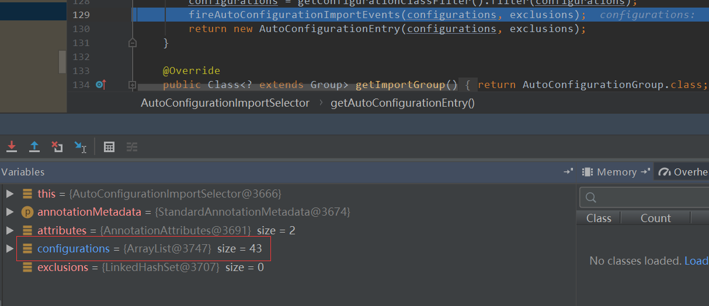

# springboot自动装配原理

## 一：什么是自动装配

> 我们现在提到自动装配的时候，一般会和 Spring Boot 联系在一起。但是，实际上 Spring Framework 早就实现了这个功能。Spring Boot 只是在其基础上，通过 SPI 的方式，做了进一步优化。
>
> > SpringBoot 定义了一套接口规范，这套规范规定：SpringBoot 在启动时会扫描外部引用 jar 包中的`META-INF/spring.factories`文件，将文件中配置的类型信息加载到 Spring 容器（此处涉及到 JVM 类加载机制与 Spring 的容器知识），并执行类中定义的各种操作。对于外部 jar 来说，只需要按照 SpringBoot 定义的标准，就能将自己的功能装置进 SpringBoot。
>
> 没有 Spring Boot 的情况下，如果我们需要引入第三方依赖，需要手动配置，非常麻烦。但是，Spring Boot 中，我们直接引入一个 starter 即可。比如你想要在项目中使用 redis 的话，直接在项目中引入对应的 starter 即可。
>
> ```text
> <dependency>
>     <groupId>org.springframework.boot</groupId>
>     <artifactId>spring-boot-starter-data-redis</artifactId>
> </dependency>
> ```
>
> 引入 starter 之后，我们通过少量注解和一些简单的配置就能使用第三方组件提供的功能了。
>
> 在我看来，自动装配可以简单理解为：**通过注解或者一些简单的配置就能在 Spring Boot 的帮助下实现某块功能。**

## 二：如何实现

### 第一步

> 我们来去看springboot的核心注解：`@SpringBootApplication`
>
> ~~~java
> @Target(ElementType.TYPE)
> @Retention(RetentionPolicy.RUNTIME)
> @Documented
> @Inherited
> //标注为springboot配置
> @SpringBootConfiguration
> //真正起到自动配置的原因
> @EnableAutoConfiguration
> //扫描类，负责实现扫描一些包下的内容，比如被@Controller标注的类
> @ComponentScan(excludeFilters = { @Filter(type = FilterType.CUSTOM, classes = TypeExcludeFilter.class),
> 		@Filter(type = FilterType.CUSTOM, classes = AutoConfigurationExcludeFilter.class) })
> public @interface SpringBootApplication {
> //...
> }
> ~~~


### 第二步

> 我们找到了真正原因，就需要进去看看了`@EnableAutoConfiguration`
>
> ~~~java
> @Target(ElementType.TYPE)
> @Retention(RetentionPolicy.RUNTIME)
> @Documented
> @Inherited
> @AutoConfigurationPackage
> //现在发现真正实现原因是导入了这个类:AutoConfigurationImportSelector
> @Import(AutoConfigurationImportSelector.class)
> public @interface EnableAutoConfiguration {
> //...
> }
> ~~~


### 第三步

> 现在我们就需要去研究一下这个`AutoConfigurationImportSelector`
>
> > 进入`AutoConfigurationImportSelector`的继承体系
> >
> > ~~~java
> > public class AutoConfigurationImportSelector implements DeferredImportSelector, BeanClassLoaderAware, ResourceLoaderAware, BeanFactoryAware, EnvironmentAware, Ordered {
> > }
> > public interface DeferredImportSelector extends ImportSelector {
> > 
> > }
> > public interface ImportSelector {
> >     //这个方法获取所有符合条件的类的全限定类名，这些类需要被加载到 IoC 容器中。
> >     String[] selectImports(AnnotationMetadata var1);
> > }
> > 
> > //这个是AutoConfigurationImportSelector给的实现
> > public String[] selectImports(AnnotationMetadata annotationMetadata) {
> >     if (!isEnabled(annotationMetadata)) {
> >         return NO_IMPORTS;
> >     }
> >     //这个方法主要负责加载自动配置类的。
> >     AutoConfigurationEntry autoConfigurationEntry = getAutoConfigurationEntry(annotationMetadata);
> >     return StringUtils.toStringArray(autoConfigurationEntry.getConfigurations());
> > }
> > ~~~
>
> **进入getAutoConfigurationEntry方法**
>
> ~~~java
> protected AutoConfigurationEntry getAutoConfigurationEntry(AnnotationMetadata annotationMetadata) {
>     //<1>
>     if (!isEnabled(annotationMetadata)) {
>         return EMPTY_ENTRY;
>     }
>     //<2>
>     AnnotationAttributes attributes = getAttributes(annotationMetadata);
>     //<3>
>     List<String> configurations = getCandidateConfigurations(annotationMetadata, attributes);
>     //<4>
>     configurations = removeDuplicates(configurations);
>     Set<String> exclusions = getExclusions(annotationMetadata, attributes);
>     checkExcludedClasses(configurations, exclusions);
>     configurations.removeAll(exclusions);
>     configurations = getConfigurationClassFilter().filter(configurations);
>     fireAutoConfigurationImportEvents(configurations, exclusions);
>     return new AutoConfigurationEntry(configurations, exclusions);
> }
> ~~~
>
> > **<1>:我们看一下这个`isEnabled`方法**
> >
> > 
> >
> > 判断自动装配开关是否打开。默认`spring.boot.enableautoconfiguration=true`，可在 `application.properties` 或 `application.yml` 中设置
> >
> > **<2>:获取排序类**
> >
> > 这个就是用来获取排除类的
> >
> > **<3>:读取配置类**
> >
> > 
> >
> > 我们可以看到这个实际上是` META-INF/spring.factories`文件中的内容
> >
> > 
> >
> > 不光是这个依赖下的`META-INF/spring.factories`被读取到，所有 Spring Boot Starter 下的`META-INF/spring.factories`都会被读取到。
> >
> > 如果我们去看下其他引入的`starter`(拿上面用到的`redis`的`starter`)，就可以看到
> >
> > 这样也告诉我们要想自己做一个starter，那么这一步必不可少
> >
> > **<4>：排除configurations中没必要加载的类**
> >
> > 这一步有经历了一遍筛选，`@ConditionalOnXXX` 中的所有条件都满足，该类才会生效。
>
> 

## 三：总结

> Spring Boot 通过`@EnableAutoConfiguration`开启自动装配，通过 SpringFactoriesLoader 最终加载`META-INF/spring.factories`中的自动配置类实现自动装配，自动配置类其实就是通过`@Conditional`按需加载的配置类，想要其生效必须引入`spring-boot-starter-xxx`包实现起步依赖